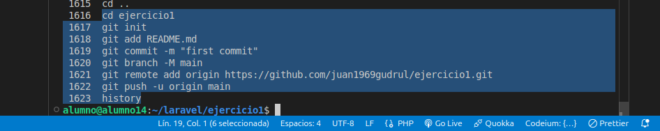
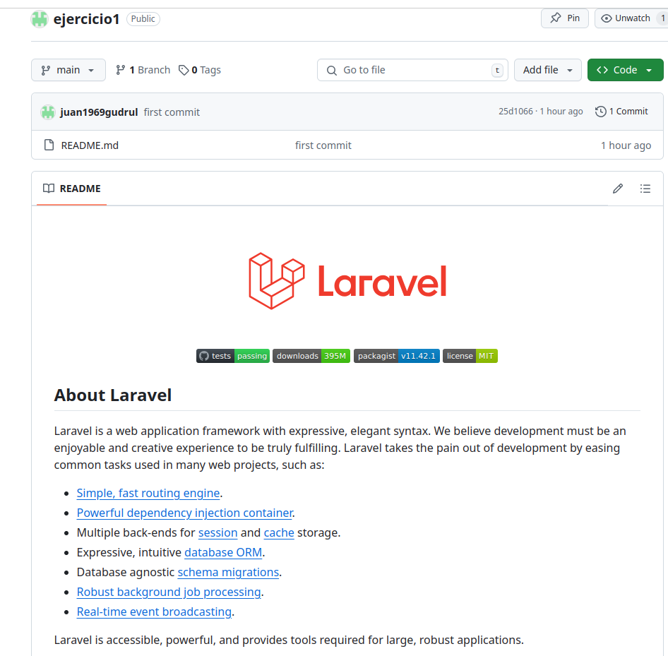
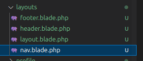
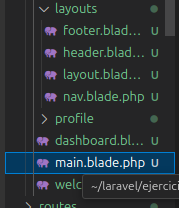

## creo el proyecto ejercicio1


1. Clonar el repositorio:

    ```bash
    git clone 
    ```

2. Instalar las dependencias:

    ```bash
    cd nombre-del-proyecto
    composer install
    npm install
    npm run dev
    ```

3. Ejecutar las migraciones:

    ```bash
    php artisan migrate
    ```

4. Iniciar el servidor:

    ```bash
    php artisan serve
    ```

Visita `http://localhost:8000` en tu navegador.

historico



laravel new ejercicio1


meto en el layout los 4 archivos



creamos el archivo main

3 Instalación y configuración de Breeze:

lo hemos hecho en la instalacion inicial, no hace falta hacerlo

